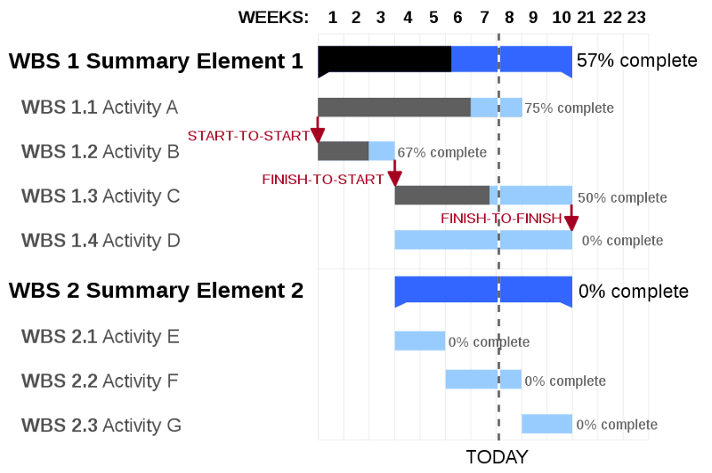
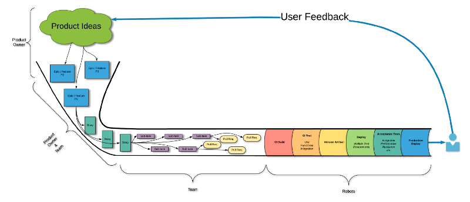

One of the most common pain points to anyone moving to modern delivery is, “how do we know we are doing it correctly?” I’d suggest setting measurable goals and frequently verifying if what we are doing is approaching those goals. However, people just starting out with too much new to learn will frequently grab metrics they think they understand and use them in ways that details the goals. This is not an exhaustive list, but they come up frequently.

### Velocity

Measuring team productivity by the number of story points delivered each sprint.

Velocity doesn’t measure productivity. Velocity is a measure of the average capacity of the team so that the team can give planning guidance. It’s also exceptionally poorly named.

*   Story points are an abstraction to attempt to mitigate how poorly humans are at estimating work. Over time, the team finds that _“this kind of work is about this big”_ and story points stabilize. Smaller work, things that take a day or two, can be estimated in time but only with a team that is practiced at doing that work as a team. This is covered in more detail in [**In 5 Minute DevOps: You Don’t Need Story Points**](https://medium.com/walmartlabs/5-minute-devops-you-dont-need-story-points-acad7f157855)**.**
*   Velocity is an average of the number of story points the team has completed in past iterations.

> ”Given we have completed **X** story points on average and that we have work that is smaller than **X \* 80%** (or so), then we can predict we’ll probably finish this work in the next iteration unless there are unexpected complications.”

If you ask a team to increase their velocity, they will. Story points will inflate. Some misguided leaders will attempt to standardize the size of a story point. That’s not possible. All they do is translate story points to time and create a math problem for everyone to solve for every story. If you want to do this, just use time. The problem is still there though. If we measure velocity as the number of estimated hours or days delivered in an iteration, then estimates get inflated to show improvement over time.

Productivity is measured by how frequently we can delivery stable changes that deliver value to the end-user.

### Agile Maturity Scores

Team Agile Maturity Scores aren’t a thing. That’s a fake metric sold by “Agile” money mills. You don’t observe “maturity” and you never mature. You inspect and adapt. The faster you can deliver, the more you can inspect, and the faster you adapt. There are no defined processes in agile development. There are known good practices that teams should be aware of and adopt as they see fit to improve their ability to deliver. Teams should review and compare their practices to the [principles of the Manifesto](https://agilemanifesto.org/principles.html).

### **Agile Adoption Rate**

This can only be measured by outcomes: delivery frequency, lead time to change, mean time to recover, and change fail rate. Those outcomes show how agile you are. There are surveys some “Agile Transformation” companies use to measure this. Based on those survey’s most teams will be industry leaders in Agile in only weeks or a few months. If someone hands you a maturity survey, find a better source.

We should set improvement goals over time and educate everyone on known good practices that help them reach those goals. Those practices only become their own if they choose them. If told how to work, they do will adopt and they have no route to improve. This is why most “agile transformations” fail. The core culture required is not adopted. “Command and control” is incompatible with improvement. Toyota learned this 50 years ago.

### **Initiative Milestones**

This assumes the initiatives will meet the goals. It’s a blind march to “we did what we said we’d do” without considering feedback on if we should be doing it at all. Instead, we should set product value delivery goals and metrics. “We will reduce the time spent doing X by 50% if we deliver this next feature”. Then reward achieving that. Even more important, reward the behavior of recognizing when that isn’t happening and changing course to a better outcome.

### Agile Maturity

This is what agile delivery looks like, the continuous delivery of value to the end-user. The faster a product can close this loop, the higher the quality and the lower the total cost of ownership. Helping the team widen their pipeline by removing waste increases their ability to deliver. Planning deliverables for the next year with set milestones makes this ability almost irrelevant. That legacy process removes learning and improving from the plan.

Measuring correctly is key and metrics must be used wisely or even the right metrics can be destructive. Measure in offsetting groups to prevent gaming. One of the exercises I do is look at metrics and use my software testing brain against them. “What can go wrong? How can I break this? How can I game this to look good?” Then I tell people.

Go forth and use meters for distance. Liters are for volume.